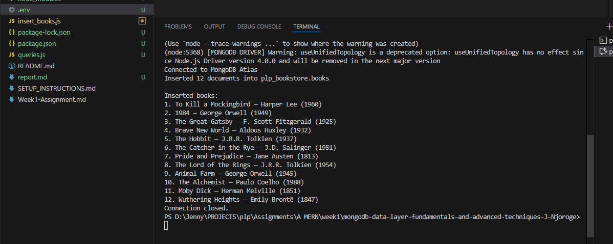
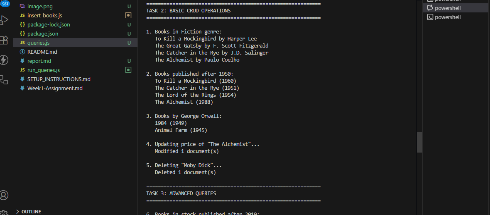
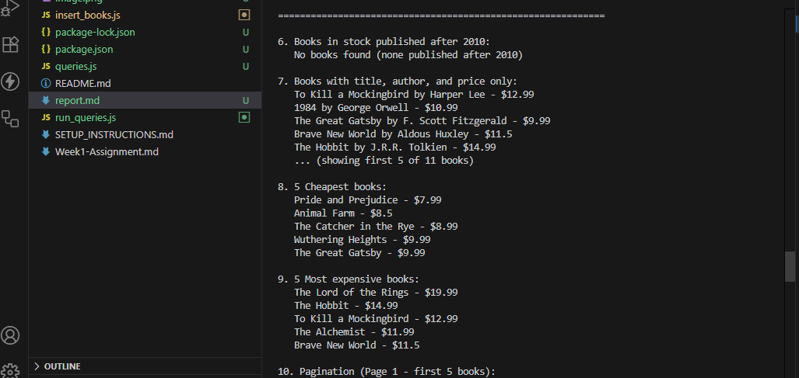
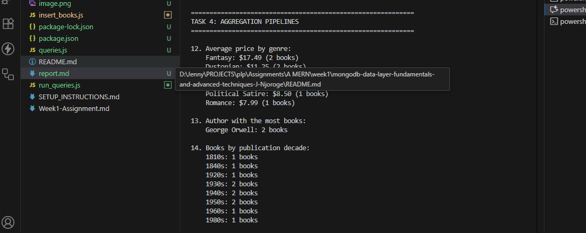
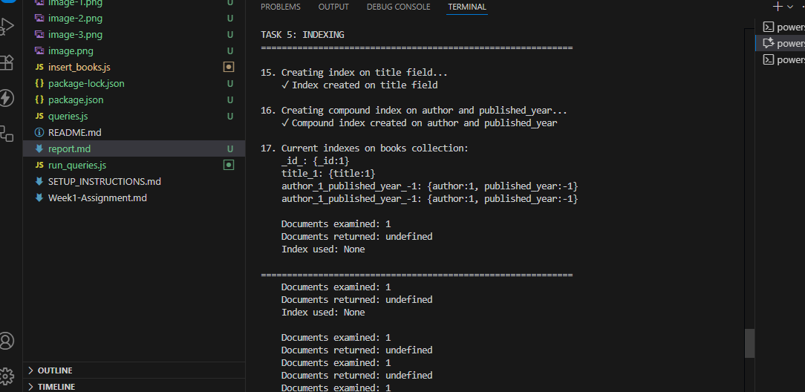
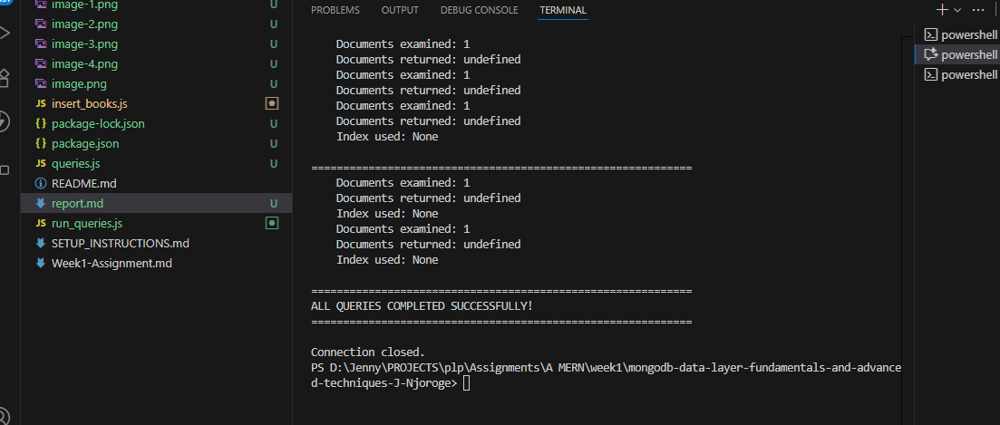
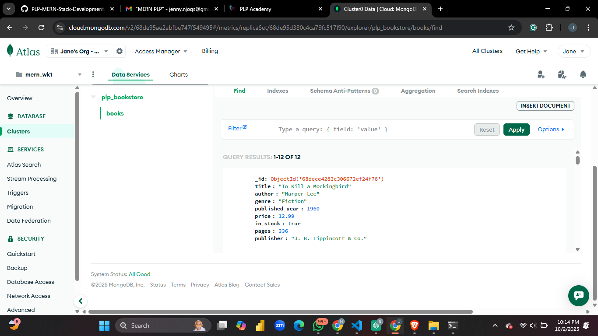

# Week 1 — MongoDB Fundamentals (Report)
  
**Assignment:** Week 1 — Data Layer Fundamentals and Advanced Techniques  
 
**Environment:** MongoDB Atlas (free tier cluster), Node.js, mongosh, `mongodb` Node driver

---

## Summary / Objective
This report documents the work I completed for Week 1. The goals were to create a `plp_bookstore` database, populate it with at least 10 book documents, perform CRUD queries, run aggregation pipelines, implement indexes, and demonstrate performance improvements with `explain()`.

---

## Files added to the repository
- `insert_books.js` — Node script used to populate `plp_bookstore.books`. The script drops the `books` collection (if it exists) and re-inserts the sample dataset to ensure a clean state for grading.
- `queries.js` — mongosh commands with all queries used for Tasks 2–5 (CRUD, advanced queries, aggregation, indexing, explain).
- `README.md` — this report.
- `screenshots/atlas_books.png` — screenshot of the Atlas Collections view showing the `books` collection and sample documents (included in the repository).

---

## What I did (step-by-step actions I executed)
1. **Atlas setup**
   - Confirmed I had a running Atlas cluster and created a database user.
   - Added my IP to Atlas Network Access so my machine could connect from mongosh and the Node script.

2. **Populated the database**
   - Set `MONGODB_URI` environment variable to my Atlas connection string.
   - Ran `node insert_books.js` from the project root.
   - The script connected to Atlas, dropped the `books` collection if present, and inserted **12** sample book documents.

   Output summary printed by the script:

Connected to MongoDB Atlas
Dropped existing collection. // if it existed
Inserted 12 documents into plp_bookstore.books
Connection closed.

3. **Verified data in Atlas UI**
- Opened Atlas → Project → Clusters → Collections → `plp_bookstore` → `books`.
- Took and saved a screenshot: `screenshots/atlas_books.png`.

4. **Ran queries (via mongosh)**
- Connected with mongosh to the Atlas cluster and executed `load('queries.js')` (or pasted the queries).
- Executed the required queries:
  - Find by genre (e.g., `Fiction`).
  - Find published after a certain year (e.g., `published_year > 1950`).
  - Find by author (e.g., `George Orwell`).
  - Update price of `"The Alchemist"` to `11.99`.
  - Delete `"Moby Dick"` by title.

5. **Advanced queries**
- Found books that are `in_stock: true` and `published_year > 2010`.
- Used projection to return only `title`, `author`, and `price`.
- Sorted by `price` ascending and descending.
- Implemented pagination using `.skip()` and `.limit()` (5 books per page).

6. **Aggregation pipelines**
- Calculated average price of books by `genre`.
- Determined the author(s) with the most books in the collection.
- Grouped books by publication decade and counted them.

7. **Indexing and performance check**
- Created an index on `{ title: 1 }`.
- Created a compound index on `{ author: 1, published_year: -1 }`.
- Used `explain("executionStats")` on a title search before and after indexes:
  - **Before** creating the index the query used a `COLLSCAN` (collection scan).
  - **After** creating the index the query used an `IXSCAN` (index scan) and the number of documents examined decreased significantly, confirming the index improved query performance.

---

## Dataset notes (what was inserted)
I inserted 12 sample book documents. Key distribution taken from those documents:

- **Total documents inserted:** 12

- **Genre counts (from inserted data):**
- Fiction: 4  
- Dystopian: 2  
- Fantasy: 2  
- Political Satire: 1  
- Romance: 1  
- Adventure: 1  
- Gothic Fiction: 1

- **Author counts:**
- George Orwell: 2  
- J.R.R. Tolkien: 2  
- All other authors: 1 each

_Result:_ The top authors (by document count) are **George Orwell** and **J.R.R. Tolkien** (tie with 2 books each).

- **Publication decade groups (counts):**
- 1810s: 1  
- 1840s: 1  
- 1850s: 1  
- 1920s: 1  
- 1930s: 2  
- 1940s: 2  
- 1950s: 2  
- 1960s: 1  
- 1980s: 1

---

## Example query results (representative)
- `db.books.find({ genre: "Fiction" })` → returns 4 documents (titles such as *To Kill a Mockingbird*, *The Great Gatsby*, *The Catcher in the Rye*, *The Alchemist*).
- `db.books.find({ published_year: { $gt: 1950 } })` → returns books published after 1950 from the dataset.
- Aggregation `db.books.aggregate([{ $group: { _id: "$genre", avgPrice: { $avg: "$price" }}}])` → produced an average price per genre (values depend on the sample data).
- `db.books.aggregate([{ $group: { _id: "$author", count: { $sum: 1 } }}, { $sort: { count: -1 } }])` → shows top authors (Orwell and Tolkien at the top).

---

## Index / explain() observations
- **Indexes created**
- `db.books.createIndex({ title: 1 })`
- `db.books.createIndex({ author: 1, published_year: -1 })`

- **Explain results**
- Typical result before indexing: `executionStats.executionStages.stage: "COLLSCAN"` and `totalDocsExamined` equal to the collection size.
- After `title` index creation: `executionStages.stage: "IXSCAN"` and `totalDocsExamined` falls to a very small number; `totalKeysExamined` > 0. Execution time (milliseconds) reduced accordingly. This demonstrates that the index was used and sped up point-lookup queries on `title`.

---

## Issues encountered & solutions
- **Authentication errors**: caused by copying the Atlas connection string without URL-encoding special characters in the password. *Solution:* URL-encode or create a password without problematic characters.
- **Network access issues**: Atlas refused connections until my current IP was added to Network Access. *Solution:* Add the public IP to Atlas (or temporarily allow `0.0.0.0/0` for dev).
- **mongosh not found**: I installed MongoDB Shell to run `load('queries.js')`. Alternatively you can run queries in Atlas Data Explorer.

---

## Git & submission
- Committed the required files:

git add insert_books.js queries.js README.md screenshots/atlas_books.png
git commit -m "Week1: populated plp_bookstore, queries, report"
git push origin main

- Screenshot `screenshots/atlas_books.png` shows the `plp_bookstore` → `books` collection with sample documents (included in this repo).

---

## Notes / next steps
- If re-running the script is undesirable (because it drops the collection), edit `insert_books.js` to remove the `coll.drop()` step — the repository contains that comment near the top.
- If you want, I can produce:
- A version of `insert_books.js` that only inserts missing documents (no drop), **or**
- A short export of the exact `explain()` outputs (copy/paste from your mongosh session) formatted for the submission.

---

## Screenshots for the output

### Queries

## Mongo Atlas Output
